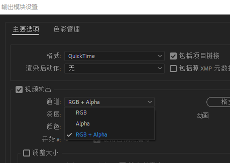
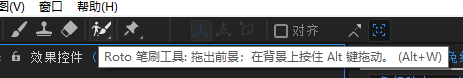
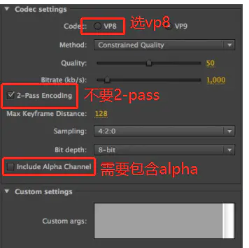

### 前言

- 因为受人之托请我裁剪掉一个webm视频的后几秒，对于编辑它做了一些研究

### 正文
- 无用废话：Adobe After Effects，Adobe Media Encoder
- 对于AE安装使用Influx插件方可导入webm格式视频，然后就随便修改了，需要注意的是，也许是WebM插件所导致的导入后视频质量轮廓有白边，于是我先卸载了这个插件然后导出.mov的视频，在输出设置里的通道使用RGB+Alpha以保留透明通道

    - 另外在这一步学到了在AE使用笔刷进行抠图，双击画面就可以开始了，抠图方式类似于PS的快速选择工具，按空格去调整每一片段抠图的部分（可惜虽然学到了但是没用上）

- 对于ME安装使用了前文提到了WebM插件，安装后即可在ME队列的设置中导出webm格式视频，按照如下设置保留透明通道（下图来自网络）
