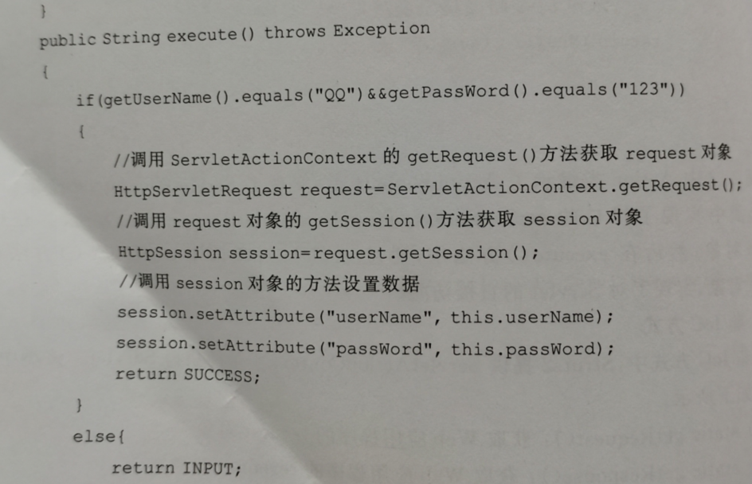

### execute（）方法 ，代码功能，代码含义
获取session对象，并在其中添加数据

### 第六章  第七章  278页  6.2章节
选择ssh框架，典型的三层构架体现MVC（模型Model,视图View和控制）思想，可以减轻开发人员重新建立解决复杂问题方案的负担。  
便于敏捷开发出新的需求，降低开发时间成本。   
优秀的解耦性，ssh三层构架，控制层依赖于业务逻辑层，但绝不与任何具体的业务逻辑组件耦合，只与接口耦合；  
同样，业务逻辑层依赖于DAO层，也不会与任何具体的DAO组件耦合，而是面向接口编程。采用这种方式的软件实现，即使软件的部分发生改变，其他部分也不会改变。

### ，作用，好处HIbernste5框架的组成
1. Configuration  
Configuration 类的作用是对Hibernate 进行配置，以及对它进行启动。  
<!-- 在Hibernate 的启动过程中，Configuration 类的实例首先定位映射文档的位置，读取这些配置，然后创建一个SessionFactory对象。 -->
2. SessionFactory   
SessionFactory接口负责初始化Hibernate。它充当数据存储源的代理，并负责创建Session对象。
3. Session  
Session接口负责执行被持久化对象的CRUD操作，它用get()、load()、save()、update()、和delete()等方法对PO进行加载、保存、更新及删除等操作。  
<!-- 但需要注意的是Session对象是非线程安全的。同时，Hibernate5的Session不同于JSP应用中的HttpSession。这里使用的Session术语，其实指的是Hibernate5中的Session。 -->
4. Transaction  
Transaction 负责事务相关的操作，用来管理Hibernate5事务，它的主要方法有commit()和rollback()，    
它是可选的，开发者也可以涉及编写自己的底层事务处理代码
<!-- 可以使用Session的beginTransaction()方法生成。   -->
5. Query  
Query负责执行各种数据库查询，可以使用HQL语言或本地数据库的SQL语句对PO进行查询操作。Query对象可以使用Session的createQuery()方法生成
6. Hibernate5的配置文件  
Hibernate5的配置文件主要用来配置置数据库连接参数，例如数据库的驱动程序、URL、用户名和密码、数据库方言等。它有两种形式：hibernate.cfg.xml或hibernate.properties。两者的配置内容基本相同，但前者比后者使用方便一点。一般情况下，hibernate.cfg.xml是Hibernate5的默认配置文件。

7. 映射文件  
映射文件用来把PO与数据库中的表、PO之间的关系与表之间关系以及PO的属性与表字段一一映射起来，它是Hibernate5的核心文件。

8. 持久化对象  
持久化对象（PO）可以是普通的JavaBean，唯一特殊的是它们与Session相关联。PO在Hibernate5中存在三种状态：临时状态（Transient）、持久化状态（Persistent）和脱管状态（Detached）
### 对象和关系数据如何关联，持久化对象状态
### 一对一关联关系编程代码，映射文件代码补全（主键关联）


#### 两个表的外键关联


#### bean

### Spring IOC
```
<beans>
<bean id="学生" class="iocexample.Student">
<property name="language" ref="英语"></property>
</bean>
<bean id="英语" class="iocexample.English"></bean>
</beans>
```
（1）该文件配置的两个Bean对象的名称分别是什么？（4分）  
学生，英语  
（2）请分析第5行代码实现的功能是什么？（3分）  
将Bean对象英语赋值给Bean对象学生的属性language  
（3）分析上面代码说明IOC的含义。（3分）
对象A获得依赖对象B的过程，由主动行为变为了被动行为，控制权颠倒过来了
‌
### Spring框架的优点
1. 非侵入式设计  
<!-- Spring是一种非侵入式（non-invasive）框架，它可以使应用程序代码对框架的依赖最小化。 -->
2. 方便解耦、简化开发  
<!-- Spring就是一个大工厂，可以将所有对象的创建和依赖关系的维护工作都交给Spring容器的管理，大大的降低了组件之间的耦合性。 -->
3. 支持AOP  
<!-- Spring提供了对AOP的支持，它允许将一些通用任务，如安全、事物、日志等进行集中式处理，从而提高了程序的复用性。 -->
4. 支持声明式事务处理  
<!-- 只需要通过配置就可以完成对事物的管理，而无须手动编程。 -->
5. 方便程序的测试  
<!-- Spring提供了对Junit4的支持，可以通过注解方便的测试Spring程序。 -->
6. 方便集成各种优秀框架  
<!-- Spring不排斥各种优秀的开源框架，其内部提供了对各种优秀框架（如Struts、Hibernate、MyBatis、Quartz等）的直接支持。 -->
7. 降低Jave EE API的使用难度。  
### Spring AOP
下面是Spring5的配置文件，该文件配置了Spring5 AOP中的通知，请分析代码并回答后面的问题。（10分）  
applicationContext.xml：

```java
<beans>
​　    <bean id="BeforeAdvice"
​　          class="adviceexample.GettingBeforeAdvice"></bean>
​　    <bean id="AfterAdvice" class="adviceexample.GettingAfterAdvice"></bean>
​　    <bean id="proxy"
​　         class="org.springframework.aop.framework.ProxyFactoryBean">
​　        <property name="proxyInterfaces"
​　           value="adviceexample.Reception"></property>
​　         <property name="interceptorNames">
​　                <list>
​　                    <value>BeforeAdvice</value>
​　                    <value>AfterAdvice</value>
​　                </list>
​　         </property>
​　         <property name="target" ref="target"></property>
​　    </bean>
​　    <bean id="target" class="adviceexample.ConcreteReception"></bean>
​　</beans>
```
（1）上面文件配置了的两种通知是用来做什么的（4分）  
前置通知在连接点（或目标对象的方法调用）之前执行  
后置通知是在目标对象的方法执行之后被调用  
（2）上面文件配置了代理工厂对象proxy，该对象有三个属性，依次是代理接口，通知和目标对象，其中，代理接口是什么？（2分）  
代理接口是adviceexample.Reception  
​
（3）分析上面代码说明AOP主要包含哪些内容？（4分）  
横切关注点，切面，连接点，通知，切入点，织入，目标，引入，代理
​


